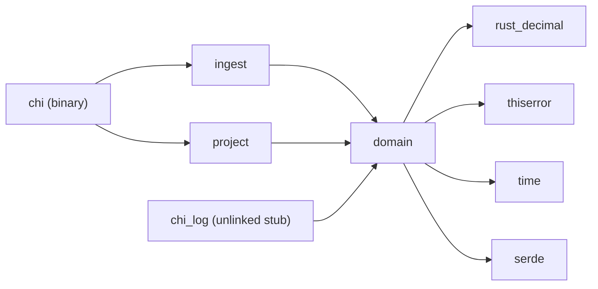
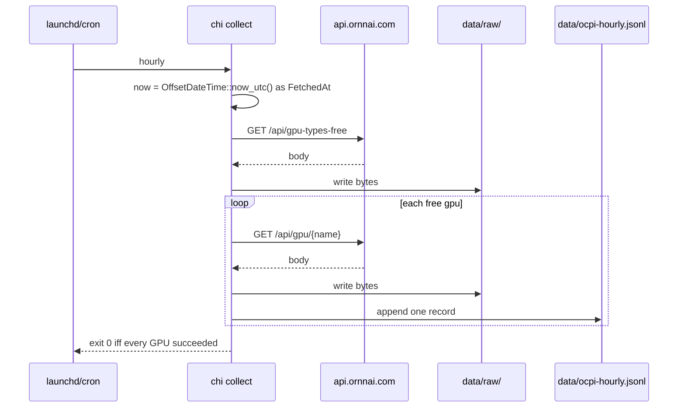
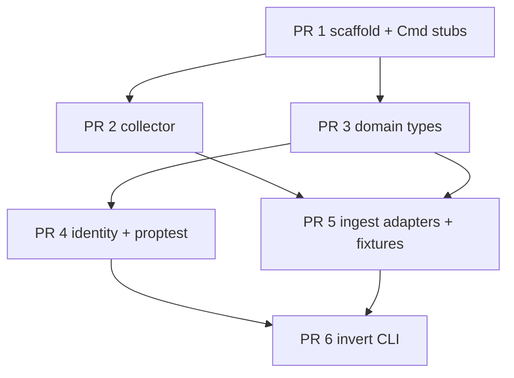

# Gate 0 + Gate 1 MVP: Hourly OCPI Collector and Typed GPU-Hour Identity

| Field | Value |
|---|---|
| **Author** | _TBD_ |
| **Date** | 2026-08-22 |
| **Status** | Approved — open questions resolved |
| **Scope** | Gates 0 and 1 only (first working system) |
| **Repo** | `/Users/shauryagunderia/PersonalProjects/compute-hedonic-index` |
| **Spec sources** | `docs/execution-plan.md`, `docs/positioning.md`, `docs/llms.txt`, `docs/source/AiComputeAssetPricing.md` §4.1 / §5.1, `AGENTS.md` (free-data constraint only) |

This document is the design for the first thing that runs. It is not a design for Gates 2–10. `docs/project-plan.md` is the seed 7-day reservation simulator and is **out of scope**; do not implement its R1–R4 engine, occupancy grid, hedge blotter, or 7-day calendar.

The owner is learning Rust on this MVP. The crate graph is small, types are explicit, there are no procedural macros, no `uom`, and no async in `domain`. Cleverness that hides ownership is a defect.

---

## Overview

The system answers a capital question, not a futures-pricing question. Given public OCPI rental \(S\) and public capital / spec / energy inputs, which declared \(\theta = (T, u, R)\) (economic life, utilization, residual) makes owning a GPU a fair deal versus renting it — and how far is that point from accounting practice (typically \(T = 6\,\mathrm{y}\), \(R = 0\))?

Bandi & Su already showed that a GPU-hour is not storable, so cash-and-carry from spot to futures fails ([`docs/source/AiComputeAssetPricing.md`](docs/source/AiComputeAssetPricing.md) §5.1). This repo does not re-derive that. They priced the perishable *service flow*. We ask about the durable *hardware stock* that produces it (`docs/positioning.md`).

The MVP does **not** compute the feasible sets \(\Theta_L(S)\) and \(\Theta_{R^{\star}}(S)\) (Gate 4). It does two things:

1. **Gate 0.** An hourly collector that fetches Ornn OCPI *current* prices for the five free GPUs, appends JSONL with `fetched_at`, and caches raw HTTP bodies under `data/raw/`. Hourly current ≠ daily settle. Lost hours cannot be reconstructed.
2. **Gate 1.** A typed domain crate that evaluates the discrete NPV identity \(F(\theta)\), the leftover rent \(L\), and the closed-form salvage inverse \(R^{\star}\), plus `chi invert --gpu "H100 SXM"` which prints the authoritative daily-index \(S\), declared \((P, T, u, r)\), both named inverses, and the accounting point \((T=6\,\mathrm{y}, R=0)\) against that \(S\). Forward \(F(\theta)\) prints only when `--residual-cents` is passed. Illegal unit joins (`Usd + UsdPerGpuHour`) do not type-check. The run is deterministic on a frozen fixture directory.

Two quantities must not share the name “implied residual”:

- **Leftover** \(L = S - F_{\mathrm{capital}} - e\) (`UsdPerGpuHour`) rises with \(S\). This is the execution-plan Gate 1 property.
- **NPV salvage** \(R^{\star}\) (`Usd` at year \(T\)) falls with \(S\). This is the closed-form NPV inverse.

Both stay indefinitely as two labeled series ([Open Questions](#open-questions) §1, resolved). Later gates, including Gate 4, treat them separately: \(\Theta_L(S)\) and \(\Theta_{R^{\star}}(S)\). Do not collapse the names.

The CS object of the wider project is: keep that inverse correct over a streaming, heterogeneous, unit-incompatible ingest log. Every published number is `event log ⊕ parameter vector ⊕ code version`. The event log itself is Gate 2; the MVP only lays the types and the raw cache so Gate 2 is not a rewrite.

---

## Background & Motivation

### Current state

The repo is documentation. Positioning exists (`docs/positioning.md`). There is no Cargo workspace, no collector, no domain types, no parser. `AGENTS.md` and `docs/project-plan.md` still describe the seed reservation-pricing simulator; `docs/execution-plan.md` is the product roadmap that replaced it. Building the old simulator would answer a different question with a different stack (Postgres, SSE, React, R1–R4).

### Why Gate 0 cannot wait for types

OCPI current prices update hourly and are not reconstructible from the free 3-month daily window. Every hour without a collector is a permanently missing observation (`docs/execution-plan.md` Gate 0; `docs/project-plan.md` Day 0, used here only as the same operational fact). The collector must start before the identity is typed.

### Why Gate 1 is the product

A collector without an identity is a wget loop. The product is: take one observed daily-index \(S\), one declared \((P, T, u, r)\), and print leftover \(L\), salvage \(R^{\star}\), and the accounting point, with units that cannot be added incorrectly. That is a working research instrument. Sweeps, replay, as-of queries, live marks, and a UI are structured improvements on it.

### Pain this MVP removes

- No running fetch, so hourly current is already being lost.
- No typed identity, so any notebook will mix USD, USD/GPU-hour, and GPU-hour as `f64`.
- No frozen-fixture invert, so there is no deterministic artifact to test against.

---

## Goals & Non-Goals

### Goals

- Ship a `chi` binary such that `cargo run -p chi -- collect` matches the command already written in `docs/positioning.md`.
- Append one JSONL record per free GPU per successful fetch, with `fetched_at`, and store the raw HTTP body under `data/raw/`.
- Document launchd (macOS) and cron so the collector can run unattended.
- Introduce a `domain` crate with no I/O (`tokio`, `reqwest`, `std::fs` forbidden).
- Represent money and physical quantities as newtypes so `Usd + UsdPerGpuHour` does not type-check.
- Implement \(F(\theta)\), leftover \(L\), and the closed-form salvage inverse \(R^{\star}\) (algebra, not a solver).
- Ingest OCPI **latest daily-index** (authoritative \(S\)), OCPI daily history (cached, not invert \(S\)), and the Epoch ML hardware CSV: cache raw, parse once.
- `cargo run -p chi -- invert --gpu "H100 SXM" --fixture-dir fixtures …` prints \(L\) and \(R^{\star}\) plus the accounting point, deterministic on fixtures. Forward \(F(\theta)\) only with `--residual-cents`.
- `proptest` gates the identity (see [Test Plan](#test-plan)).
- Carry `AsOf` / `FetchedAt` fields from day one even though bitemporal query is Gate 6.

### Non-goals (this MVP)

See [Out of Scope](#out-of-scope-gates-2-10) for the named later gates. In particular this design does **not**:

- Compute the \(\Theta_L(S)\) or \(\Theta_{R^{\star}}(S)\) surfaces (Gate 4; two series, not one residual axis).
- Estimate OCPI half-life or mean reversion.
- Point-estimate residual, utilization, or purchase price from data.
- Invent defaults for \(P\), \(r\), primary \(T\), or primary \(u\) (required flags; OQ 2–4 deferred).
- Invert A100 SXM4 (OQ 5: fail closed until someone inverts that SKU).
- Implement an event-sourced command log or replay (Gate 2).
- Stand up Postgres, SQLite, axum, SSE, React, or AWS.
- Fetch PJM / CAISO LMP (Gate 3 extension point only).
- Publish an index, operate an exchange, or price residual-value swaps.
- Implement the seed plan’s R1–R4 engine, occupancy grid, hedge blotter, or 7-day calendar.

---

## Proposed Design

### Crate graph

Package name for the binary is **`chi`**, not `cli`. Positioning already documents `cargo run -p chi -- collect`. Gate 1 is the same binary with a second subcommand.

The execution-plan directory `crates/log` would collide with the crates.io `log` crate the moment anyone adds logging. The stub lives at `crates/chi_log` with package name `chi_log`. **Nothing in the MVP depends on `chi_log`.** It is a workspace member so the graph does not churn at Gate 2; invert state must not land there.

```
crates/
  domain/      # quantities, θ, F, L, R*, inverse — NO tokio, NO fs, NO reqwest
  ingest/      # HTTP, raw cache, OCPI + Epoch adapters → domain values
  chi_log/     # STUB. Gate 2 owns replay. MVP binaries do not link it.
  project/     # THIN. Invert report assembly only. No Θ sweep.
  chi/         # clap binary: collect, invert
```



`domain` depends on **nothing else in this repo**. Allowed third-party deps in `domain`: `rust_decimal`, `thiserror`, `time`, `serde`. Forbidden in `domain`: `tokio`, `reqwest`, `std::fs`, `clap`, `anyhow`. Do not enable `rust_decimal`’s float serde feature.

`ingest` may use `reqwest` **blocking** (see Key Decisions), `serde_json` with the `arbitrary_precision` feature, `thiserror`, `sha2`, `csv`. No Tokio runtime in the MVP.

`chi` uses `clap` and `anyhow` at the binary edge. `chi` depends on `ingest`, `project`, and `domain` (directly or via those). It does **not** depend on `chi_log`.

### Learning split

| Crate | What it teaches | What it is not |
|---|---|---|
| `domain` | Ownership, newtypes, `Result`, `rust_decimal`, modules | I/O, async, macros |
| `ingest` | `Result` at a network/fs boundary, adapters | Domain math |
| `chi` | `clap`, printing, exit codes | Identity logic |
| `chi_log`, `project` | Workspace members can be stubs | Replay, Θ |

No generic soup. No trait objects in `domain`. The one trait in the MVP is `ingest::HttpGet`, so collector tests do not hit the network.

### The identity \(F(\theta)\)

#### What this is, and what it is not

\(F(\theta)\) is the **fair rental rate in USD per GPU-hour** that sets the discrete NPV of *buying the chip and earning the rental stream* to zero. It is an owner-vs-rent identity on the hardware stock.

It is **not** a futures price. Bandi & Su §5.1: a GPU-hour unused today cannot be delivered next month, so there is no cash-and-carry map \(S_t \mapsto F_t(T)\). We cite that result; we do not re-derive it; we do not use \(F(\theta)\) as a stand-in for \(F_t(T)\). Their \(F_t(T)\) is a futures quote on a rental index. Our \(F(\theta)\) is a capital-recovery rent.

#### Symbols, units, and who sets them

| Symbol | Meaning | Unit (newtype) | Role in MVP |
|---|---|---|---|
| \(S\) | Observed OCPI **latest daily-index** settle | `UsdPerGpuHour` | **Observed.** From `ocpi.daily-index` only. Not hourly current. Not history’s last point. |
| \(P\) | Purchase outlay for one GPU | `Usd` | **Declared** via `--purchase-cents`. Band deferred (OQ 2). Not an MSRP. Not Epoch “Release price”. |
| \(T\) | Economic life | `Years` (positive integer) | **Declared** via `--life-years`. Do not silently use \(T=6\) as primary. Accounting overlay uses \(T=6\) as a *labeled scenario*. |
| \(u\) | Utilization: fraction of civil hours the GPU is on and earning \(S\) | `Utilization` in \((0, 1]\) | **Declared** via `--utilization`. Unobserved. Not fitted. Do not silently use \(u=1\). |
| \(R\) | Salvage value of the GPU at end of year \(T\) | `Usd` | **Declared only** when `--residual-cents` is passed (needed for \(F(\theta)\)). Never silently 0 except the labeled accounting scenario. |
| \(R^{\star}(S)\) | Break-even salvage at \(T\) given \(S\) | `Usd` | **Solved** (closed form). Falls with \(S\). May be negative. |
| \(L(S)\) | Leftover / unexplained rent | `UsdPerGpuHour` | **Solved:** \(L = S - F_{\mathrm{capital}} - e\). Rises with \(S\). |
| \(e\) | Energy cost per *utilized* GPU-hour | `UsdPerGpuHour` | Computed: \(\mathrm{kW}\cdot\mathrm{h}\cdot\mathrm{USD/kWh}\). Default price \(= 0\) so \(e = 0\), but the product is still evaluated. |
| \(r\) | Annual discount rate | `DiscountRate` | **Declared** via `--discount-rate`. No default in the binary. Not a fitted WACC. |
| \(H\) | Civil hours per year | `GpuHour` per year | Constant `HOURS_PER_YEAR = 8760`. |
| \(h = u H\) | Utilized GPU-hours per year | `GpuHour` / year | Derived: `Utilization * GpuHour → GpuHour`. |
| \(\mathrm{TDP}\) | Chip thermal design power | `Kilowatt` (`f64`) | Observed from Epoch for the mapped row. Physics. |
| \(\pi\) | Electricity price | `UsdPerKwh` | **Declared.** Default `0`. |
| \(\mathrm{PUE}\) | Power usage effectiveness | dimensionless `f64` | Extension point. MVP treats as `1.0`. Gate 3 sweeps it. |

**Swept later (Gate 4), not in MVP:** two labeled surfaces, not one residual axis. \(\Theta_L(S)\) is the \((T, u)\) (and optional \(P\), PUE) cells where leftover \(L\) matches \(S\) within \(\varepsilon\). \(\Theta_{R^{\star}}(S)\) is the \((T, u, R)\) cells where salvage \(R^{\star}\) is consistent with \(S\) within \(\varepsilon\). Do not collapse \(L\) and \(R^{\star}\) onto one grid.

**Never estimated, in this repo’s method:** OCPI half-life / mean reversion (`docs/execution-plan.md` non-negotiables; `docs/project-plan.md` §5.3 as the same methodological rule, not as a license to build the seed estimator).

#### Discrete NPV (annual, end-of-year)

Owner cash flows for one GPU:

- \(t = 0\): pay \(P\).
- \(t = 1,\ldots,T\): receive \((S - e)\, h\) (rent net of energy on utilized hours).
- \(t = T\): receive salvage \(R\).

Fair deal \(\Leftrightarrow\) NPV \(= 0\):

\[
P = (S - e)\, h\, A(r,T) + R\, (1+r)^{-T}
\]

Annuity factor:

\[
A(r,T) =
\begin{cases}
\dfrac{1 - (1+r)^{-T}}{r} & r \neq 0 \\[8pt]
T & r = 0
\end{cases}
\]

Units check: \((S-e)\) is `UsdPerGpuHour`; \(h\) is `GpuHour`/year; \(A\) is years; product is `Usd`. \(R\,(1+r)^{-T}\) is `Usd`. Both sides `Usd`.

#### Forward: evaluate \(F(\theta)\)

\(\theta\) is the declared vector \((P, T, u, R, e, r)\). \(R\) is required. Solve the identity for the rental rate:

\[
F(\theta) = e + \frac{P - R\,(1+r)^{-T}}{h\, A(r,T)}
\qquad [\texttt{UsdPerGpuHour}]
\]

Define the **capital-recovery rent at scrap-zero** (used by leftover; not a second name for \(F\)):

\[
F_{\mathrm{capital}}(P,T,u,r) = \frac{P}{h\, A(r,T)}
\qquad [\texttt{UsdPerGpuHour}]
\]

So \(F(\theta) = e + F_{\mathrm{capital}} - R(1+r)^{-T}/(h A)\) when \(R\) is declared. When \(R = 0\), \(F(\theta) = e + F_{\mathrm{capital}}\).

```rust
// crates/domain/src/identity.rs
pub fn fair_rent(theta: &Theta) -> Result<UsdPerGpuHour, IdentityError> { /* ... */ }
pub fn capital_rent(ex: &ThetaExResidual) -> Result<UsdPerGpuHour, IdentityError> { /* P / (h A) */ }
```

Rejects \(u = 0\), \(T = 0\), non-finite physics inputs, and \(A = 0\).

`fair_rent` is not called unless the caller constructed a `Theta` with a declared `salvage`. The CLI constructs that struct only when `--residual-cents` is present.

#### Inverse A: leftover \(L(S)\) (rises with \(S\))

Unexplained rent after capital recovery at \(R = 0\) and energy. This is the Gate 3 cost-stack residual, computed in Gate 1 so the execution-plan property is a named, tested quantity — not a rename of salvage.

\[
L(S) = S - F_{\mathrm{capital}}(P,T,u,r) - e
\qquad [\texttt{UsdPerGpuHour}]
\]

\[
\frac{\partial L}{\partial S} = 1 > 0
\]

```rust
pub fn leftover(obs: ObservedSpot, ex: &ThetaExResidual) -> Result<UsdPerGpuHour, IdentityError> { /* ... */ }
```

Do not call this `implied_residual`. JSON key: `leftover_usd_per_gpu_hour`. Text label: `L leftover`.

#### Inverse B: closed-form salvage \(R^{\star}(S)\) (falls with \(S\))

Algebra, not binary search. From the NPV identity:

\[
R^{\star}(S) = (1+r)^{T}\Bigl(P - (S - e)\, h\, A(r,T)\Bigr)
\qquad [\texttt{Usd}]
\]

```rust
pub fn implied_salvage(obs: ObservedSpot, ex: &ThetaExResidual) -> Result<Usd, IdentityError> { /* ... */ }
```

Do not call this `implied_residual`. JSON key: `implied_salvage_usd`. Text label: `R* salvage`.

Round-trip (up to `Decimal` epsilon): \(F(T,u,R^{\star}(S),\ldots) = S\) and \(R^{\star}(F(\theta)) = R\). That identity is a unit-test of the algebra. It is **not** printed as a “second direction” of invert when `--residual-cents` is omitted (that print would be the tautology \(F(R^{\star})=S\)).

**Sign.** \(\partial R^{\star}/\partial S = -(1+r)^{T}\, h\, A(r,T) < 0\). A higher observed rent recovers more capital, so break-even salvage is *lower* (and can be negative). Negative \(R^{\star}\) is a valid output: it means even scrap-zero ownership beats renting at that \(S\). Do not clamp to zero.

#### Accounting point

Labeled scenario, not a hidden default and not a claim about any 10-K (Gate 3 extracts the filing). Same declared \(P, u, e, r\); force \(T = 6\), \(R = 0\); print \(F_{\mathrm{acct}}\) versus \(S\). Also print leftover \(L\) and salvage \(R^{\star}\) at that same \(T=6\) under their own names. Never treat accounting \(R=0\) as a silent default for the primary \(\theta\).

#### Energy term

Even when the default scenario sets the electricity price to zero:

\[
e = \underbrace{\mathrm{TDP}}_{\mathrm{kW}} \cdot \underbrace{1}_{\mathrm{h}} \cdot \underbrace{\pi}_{\mathrm{USD/kWh}} \cdot \underbrace{\mathrm{PUE}}_{1.0}
\quad [\texttt{UsdPerGpuHour}]
\]

`f64` is allowed for kW. Money stays `Decimal`. The multiply lives in `crates/domain/src/energy.rs` as a named function, not as `f64 * f64` that is later “interpreted as dollars”.

```rust
pub fn energy_per_gpu_hour(tdp: Kilowatt, price: UsdPerKwh, pue: Pue) -> Result<UsdPerGpuHour, IdentityError>;
```

`e` is **computed then stored** on `Theta` / `ThetaExResidual` as `UsdPerGpuHour`. The identity does not recompute TDP inside `fair_rent`.

H100 SXM maps to Epoch row `NVIDIA H100 SXM5 80GB`, TDP \(700\,\mathrm{W} = 0.7\,\mathrm{kW}\) (see ingest mapping). That TDP is used only as a physics factor. Epoch “Release price (USD)” \(33600\) is **not** \(P\).

### Type model

Illegal unit joins must be unrepresentable. Internal newtypes, not the `uom` crate (macro surface is the wrong lesson for this MVP).

```rust
// crates/domain/src/money.rs
#[derive(Clone, Copy, Debug, PartialEq, Eq, PartialOrd, Ord)]
pub struct Usd(Decimal);              // from_cents(i64) or try_from Decimal

#[derive(Clone, Copy, Debug, PartialEq, Eq, PartialOrd, Ord)]
pub struct UsdPerGpuHour(Decimal);

#[derive(Clone, Copy, Debug, PartialEq, Eq)]
pub struct UsdPerKwh(Decimal);

// crates/domain/src/qty.rs
pub struct GpuHour(Decimal);
pub struct Years(u32);
pub struct Utilization(Decimal);      // (0, 1]
pub struct DiscountRate(Decimal);     // >= 0, per year
pub struct Kilowatt(f64);             // physics
pub struct Hours(f64);                // duration; not GpuHour
pub struct Pue(f64);

// crates/domain/src/gpu.rs
pub enum GpuModel {
    H100Sxm,
    H200,
    B200,
    A100Sxm4,
    Rtx5090,
}

pub struct H100eHour(Decimal);

// crates/domain/src/time.rs
pub struct FetchedAt(time::OffsetDateTime); // transaction time
pub struct ValidOn(time::Date);             // market / settlement date (UTC date of source timestamp)
pub struct AsOf(time::Date);                // query time; unused until Gate 6, field exists

// crates/domain/src/spot.rs
pub enum SpotSeries {
    OcpiDailyIndex, // invert S. OcpiCurrent and OcpiDailyHistory are absent on purpose.
}

pub struct ObservedSpot {
    pub gpu: GpuModel,
    pub series: SpotSeries,       // only OcpiDailyIndex in MVP
    pub valid_on: ValidOn,
    pub price: UsdPerGpuHour,     // S
    // FetchedAt is ingest-local (DailyIndexRecord). Not on this type.
}

// crates/domain/src/theta.rs
pub struct Theta {
    pub purchase: Usd,              // P
    pub life: Years,                // T
    pub utilization: Utilization,   // u
    pub salvage: Usd,               // R — required; this struct is the forward path
    pub energy: UsdPerGpuHour,      // e, precomputed by energy_per_gpu_hour
    pub discount: DiscountRate,     // r
}

pub struct ThetaExResidual {
    pub purchase: Usd,
    pub life: Years,
    pub utilization: Utilization,
    pub energy: UsdPerGpuHour,
    pub discount: DiscountRate,
}

impl ThetaExResidual {
    pub fn utilized_hours_per_year(&self) -> Result<GpuHour, IdentityError> {
        Ok(self.utilization * HOURS_PER_YEAR)
    }
}
```

Mixing `ocpi.current` into invert is unrepresentable in `domain`: `SpotSeries` has no current variant. Refusal at the ingest/CLI boundary constructs `ObservedSpot` only from the per-GPU daily-index fixture (`fixtures/ocpi/daily-index/{slug}.json`). `FetchedAt` stays on the ingest-local wrapper record, not on `ObservedSpot`.

Allowed operations (implement `Mul` / `Div` only for these):

- `UsdPerGpuHour * GpuHour -> Usd`
- `Usd / GpuHour -> UsdPerGpuHour`
- `Utilization * GpuHour -> GpuHour`  (`h = u H`)
- `Kilowatt * Hours -> f64` (kWh), only inside `energy_per_gpu_hour`

**Must not compile** (rustdoc ` ```compile_fail ` in `crates/domain/src/money.rs`):

- `Usd + UsdPerGpuHour`
- `Usd + GpuHour`
- `UsdPerGpuHour + GpuHour`
- `Kilowatt + UsdPerKwh`
- `GpuHour + H100eHour`

There is no `Add` impl across these types. Same-type `Usd + Usd` is allowed.

H100 → H100e is the **identity** in Gate 1 (`crates/domain/src/convert.rs`). FLOPS-based conversion for other SKUs is Gate 5. If `H100eHour` is introduced, the only implemented map is:

```rust
pub fn to_h100e(hours: GpuHour, gpu: GpuModel) -> Result<H100eHour, ConvertError> {
    match gpu {
        GpuModel::H100Sxm => Ok(H100eHour(hours.0)),
        other => Err(ConvertError::NotInMvp(other)),
    }
}
pub fn from_h100e_as_h100(h: H100eHour) -> GpuHour { GpuHour(h.0) }
```

Money construction: `Usd::from_cents(i64)` is the preferred declared-purchase path (integer cents). Arithmetic uses `rust_decimal::Decimal` so \(R^{\star}\) is not forced through a cent grid. Text display: scale 2 for USD totals, scale 4 for USD/GPU-hour. JSON: source-token \(S\); computed money `round_dp(12)` (see CLI sample). Never emit more than 28 significant digits.

`f64` appears only on physics (`Kilowatt`, `Hours`, `Pue`, FLOPS later). Converting `f64` into money is forbidden on the OCPI path. The only `f64 → Decimal` conversion in the MVP is inside `energy_per_gpu_hour` (kW · h · USD/kWh), via `Decimal::from_f64_retain`, `Err` on NaN/Inf.

#### Money serde (no `f64`)

Domain money types implement `Serialize`/`Deserialize` **as decimal strings only**. Do not enable `rust_decimal` float or number serde. A JSON number in a domain DTO is a schema error.

Ingest parse of Ornn `index_value` (live bodies are JSON numbers; our JSONL stores strings):

1. Enable `serde_json` feature `arbitrary_precision` in `ingest` so `serde_json::Number` keeps the lexer’s decimal text, not an `f64`.
2. Accept `index_value` as either a number or a string (`serde_json::Value`).
3. Convert with `Decimal::from_str_exact` on that text (`Number::to_string()` or the string contents).
4. Never `as f64`, never `serde_json` default number → `f64` → `Decimal`, never `format!("{}", f64)`.

Gate 0 JSONL writes the **same canonical text** extracted from the raw body (step 2–3, then store the `Decimal`’s or the source token’s text). A later parser is not reconstructing digits from a float.

### Ingest

Six feeds, four series kinds (`ocpi.current`, `ocpi.daily-index`, `ocpi.daily-index-all`, `ocpi.daily-history`), one rule: **write bytes first, parse later.** Daily-index, daily-index-all, and daily-history are **not** interchangeable.

| Feed | Endpoint | Series id | First gate | Parsed into domain? | Role |
|---|---|---|---|---|---|
| OCPI current | `GET https://api.ornnai.com/api/gpu/{gpuName}` | `ocpi.current` | 0 | No (JSONL + raw only) | Hourly collector |
| OCPI free GPU list | `GET https://api.ornnai.com/api/gpu-types-free` | `ocpi.gpu_types_free` | 0 | Names only, ingest-local | Allow-list |
| OCPI **latest daily-index** (per GPU) | `GET https://api.ornnai.com/api/daily-index?gpu=` | `ocpi.daily-index` | 1 | Yes → `ObservedSpot` via ingest wrapper | **Authoritative invert \(S\).** Invert reads only `fixtures/ocpi/daily-index/{slug}.json`. |
| OCPI latest daily-index (all GPUs) | `GET https://api.ornnai.com/api/daily-index/all` | `ocpi.daily-index-all` | 1 | Collect fixture only | **Not invert \(S\).** Same close, different file. |
| OCPI daily history | `GET https://api.ornnai.com/api/gpu/{gpuName}/index-history` | `ocpi.daily-history` | 1 | Yes, ingest-local points | Cached 3-month window. **Not invert \(S\).** Free history `index_value` is rounded to 2 decimals. |
| Epoch hardware CSV | `GET https://epoch.ai/data/ml_hardware.csv` | `epoch.ml_hardware` | 1 | Specs + TDP; **not** purchase \(P\) | Energy / later conversion |

OTPI endpoints exist on the same host. Do not call them.

Verified live on 2026-08-22 for H100 SXM on the same timestamp `2026-08-21T20:00:00.000Z`:

| Source | `index_value` |
|---|---|
| `/api/daily-index` and `/api/daily-index/all` | `2.879583333333333` |
| `/api/gpu/H100%20SXM/index-history` last point | `2.88` |
| `/api/gpu/H100%20SXM` current | `2.61` (different series; different `last_updated`) |

Invert \(S\) is **`2.879583333333333`** from the **per-GPU** daily-index fixture. History’s `2.88` must not appear as invert \(S\). `/api/daily-index/all` is a collect fixture, not an invert source. Parsers must tolerate extra fields (`access`, `region`, `count`).

Live HTTP envelopes (do not hard-code values into domain). The daily-index parser **always** unwraps `success` / `data`. A fixture that is only the inner object is invalid.

Current (`/api/gpu/H100%20SXM`):

```json
{"success":true,"data":{"gpu_name":"H100 SXM","region":"","index_value":2.61,"last_updated":"2026-08-22T04:02:40.996Z"}}
```

Latest daily-index **HTTP body** (`GET /api/daily-index?gpu=H100%20SXM`):

```json
{
  "success": true,
  "data": {
    "gpu_type": "H100 SXM",
    "region": "global",
    "index_value": 2.879583333333333,
    "date": "2026-08-21T20:00:00.000Z"
  }
}
```

`/api/daily-index/all` is the same envelope with `"data": [ {...}, ... ]` plus top-level `date` / `count`. Collect caches that raw body. Invert does not open it.

Daily history (shape; last point is rounded — do not use as invert \(S\)):

```json
{"success":true,"gpu_type":"H100 SXM","access":"public-3mo","data":[{"timestamp":"2026-08-21T20:00:00.000Z","index_value":2.88}]}
```

Ornn docs: fetch `/api/gpu-types-free` rather than hard-coding the five names. Collector does that, then requests only those names. Tests fixture the list.

#### Raw cache layout

```
data/
  raw/
    ocpi/
      gpu-types-free/{fetched_at}.json
      current/{gpu_slug}/{fetched_at}.json
      daily-index/{gpu_slug}/{fetched_at}.json
      daily-index-all/{fetched_at}.json
      daily-history/{gpu_slug}/{fetched_at}.json
    epoch/
      ml_hardware/{fetched_at}.csv
  ocpi-hourly.jsonl          # Gate 0 append-only; gitignored
```

`{fetched_at}` is UTC compact **with nanoseconds** `2026-08-22T040301123456789Z` so two collects in the same UTC second do not collide. `{gpu_slug}` is the OCPI name with spaces → `_` (`H100_SXM`). Bodies are written exactly as received (no pretty-print, no re-encode). SHA-256 of the body is recorded on the JSONL line so Gate 2 can switch to content-addressed storage without changing the collector record.

`data/raw/` and `data/ocpi-hourly.jsonl` are gitignored. Fixtures are not.

#### Gate 0 JSONL record (ingest-local, not a domain type)

```json
{
  "schema": "ocpi.hourly.v1",
  "series": "ocpi.current",
  "gpu_name": "H100 SXM",
  "index_value": "2.61",
  "source_last_updated": "2026-08-22T04:02:40.996Z",
  "fetched_at": "2026-08-22T04:03:01.000Z",
  "valid_on": null,
  "source_url": "https://api.ornnai.com/api/gpu/H100%20SXM",
  "http_status": 200,
  "raw_path": "data/raw/ocpi/current/H100_SXM/2026-08-22T040301000000000Z.json",
  "raw_sha256": "…"
}
```

`index_value` is the **source token text** (see Money serde). `valid_on` is null on current (hourly current is not a daily settle). Daily-index records set `valid_on` to the **UTC calendar date** of the source `date` / `timestamp` field.

Gate 0 does **not** construct `UsdPerGpuHour`. That keeps the collector shippable before newtypes exist, and it keeps a parse bug from blocking the only irrecoverable write.

#### Collector behaviour



- Sequential fetches, ~200 ms pause, one `User-Agent: chi-collector/0.1 (research; OCPI current; no key)`.
- `LiveHttp` timeout: **15 seconds** connect+read (`reqwest::blocking::ClientBuilder::timeout`). A hung `api.ornnai.com` must fail the job, not overlap the next hour.
- Attempt all GPUs even if one fails. Write every success. Exit `1` if any request or write failed, **or if `gpu-types-free` is empty** (zero names is not a successful no-op).
- No retries beyond a single retry on transport error. A missed hour is missed; do not invent a point.
- No API key. A 401 on a non-free GPU is a bug in the allow-list, not a prompt to add a key.
- `FetchedAt` is injected as a value (`collect_current(now, http, cache)`). Tests pass a frozen timestamp.

HTTP lives behind:

```rust
// crates/ingest/src/http.rs
pub struct RawResponse { pub status: u16, pub bytes: Vec<u8>, pub url: String }

pub trait HttpGet {
    fn get(&self, url: &str) -> Result<RawResponse, IngestError>;
}
```

`LiveHttp` uses `reqwest::blocking` with the 15s timeout. `FixtureHttp` reads `fixtures/`. No Tokio.

#### Gate 1 parsers

`crates/ingest/src/ocpi_daily.rs` and `crates/ingest/src/epoch.rs` read **cached or fixture bytes** and emit domain values. They do not fetch unless the CLI subcommand is `collect --series …`. `invert` never requires the network and never opens `ocpi.current`, `ocpi.daily-history`, or `ocpi.daily-index-all` as \(S\).

`fetched_at` is **not** on `ObservedSpot`. It lives on an ingest-local wrapper record:

```rust
// crates/ingest/src/ocpi_daily.rs
pub struct DailyIndexRecord {
    pub fetched_at: FetchedAt,   // wrapper field; never mtime, never now()
    pub source_url: String,
    pub spot: ObservedSpot,      // series = OcpiDailyIndex; no FetchedAt
}
```

Parser always unwraps the HTTP envelope `success` / `data` inside `body`. A missing `success`, `success: false`, or a fixture that is only the inner `{gpu_type, index_value, date}` object is `Err`.

`valid_on`: UTC date of `body.data.date`. For `"2026-08-21T20:00:00.000Z"` that is `2026-08-21`, not the operator’s local calendar date. Tests must use a 20:00Z fixture so a local-TZ conversion fails CI.

Invert \(S\) path is **exactly** `{fixture_dir}/ocpi/daily-index/{slug}.json` (H100 SXM → `H100_SXM.json`). One file per GPU. No directory scan, no `mtime`, no “latest `fetched_at`” among several snapshots. Missing file → error naming `ocpi.daily-index` and that path. `--as-of` is not implemented (Gate 6).

Daily-history parser exists so we can assert it is **not** the invert source (test: history last point `2.88` ≠ invert \(S\)).

#### Invert fixture contract (authoritative \(S\))

Committed bytes of `fixtures/ocpi/daily-index/H100_SXM.json` — invert and golden stdout are judged on this file:

```json
{
  "fetched_at": "2026-08-22T12:00:00.000Z",
  "source_url": "https://api.ornnai.com/api/daily-index?gpu=H100%20SXM",
  "body": {
    "success": true,
    "data": {
      "gpu_type": "H100 SXM",
      "region": "global",
      "index_value": 2.879583333333333,
      "date": "2026-08-21T20:00:00.000Z"
    }
  }
}
```

- `fetched_at` on the wrapper is the printed transaction time (`2026-08-22T12:00:00.000Z`).
- `body` is the live HTTP envelope, not the inner object alone.
- `index_value` is the JSON number `2.879583333333333`; parse via `arbitrary_precision` + `from_str_exact`.
- `fixtures/ocpi/daily-index-all.json` is a **collect** fixture (raw `/api/daily-index/all` envelope). Invert must not open it.

Collect `--series daily` writes the **raw** HTTP body under `data/raw/ocpi/daily-index/{slug}/{fetched_at}.json` (and the all-GPU body under `daily-index-all/`). Promoting a capture to an invert fixture is a deliberate commit: wrap `{fetched_at, source_url, body}` and write `fixtures/ocpi/daily-index/{slug}.json`. Do not copy the raw body in as the fixture; do not use file `mtime`.

#### Epoch mapping (fail closed)

| OCPI `gpu_name` | Epoch `Hardware name` | Used in MVP invert? |
|---|---|---|
| `H100 SXM` | `NVIDIA H100 SXM5 80GB` | Yes (TDP 700 W) |
| `H200` | `NVIDIA H200 SXM` | Parse only |
| `B200` | `NVIDIA B200` | Parse only |
| `A100 SXM4` | *out of scope* until someone inverts A100 | Fail closed. Do not guess 40 vs 80 GB (OQ 5). |
| `RTX 5090` | *no row in Epoch CSV as of 2026-08-22* | Do not invent TDP |

The map is a static table in `crates/ingest/src/epoch.rs`. Unmapped GPU + energy requested → `Err`. `invert --gpu "H100 SXM"` with energy price 0 still loads TDP so the energy product runs.

Epoch columns we read: `Hardware name`, `TDP (W)`, `Memory (bytes)`, `Tensor-FP16/BF16 performance (FLOP/s)`, `FP8 performance (FLOP/s)`, `Release date`. We **parse and store** `Release price (USD)` as an annotation on the ingest record (`EpochRow.release_price_usd: Option<Decimal>`) and **never** copy it into `Theta.purchase`.

#### Fixture strategy (offline-deterministic invert)

```
fixtures/
  ocpi/
    gpu-types-free.json
    current/H100_SXM.json
    current/H200.json
    current/B200.json
    current/A100_SXM4.json
    current/RTX_5090.json
    daily-index/H100_SXM.json          # invert S ONLY; wrapper + success/data envelope
    daily-index-all.json               # collect fixture; invert must not open
    daily-history/H100_SXM.json        # last point 2.88; not invert S
  epoch/
    ml_hardware.excerpt.csv            # header + the mapped rows, not the full 170+
```

`chi invert --fixture-dir fixtures` reads **only** `{fixture_dir}/ocpi/daily-index/{slug}.json` for \(S\). It does not read `daily-index-all.json`, `daily-history/`, `current/`, or `data/`. CI and `cargo test` use that one file. There is **no** `--data-dir` on invert in this MVP.

Capture of new fixtures: `chi collect --series daily` and `chi collect --series epoch` write raw HTTP bodies under `data/raw/`. The operator wraps a chosen per-GPU body as `{fetched_at, source_url, body}` and commits `fixtures/ocpi/daily-index/{slug}.json`. Tests never write fixtures.

### CLI surface

Binary package: **`chi`**. Two subcommands in the MVP.

```
chi collect [--data-dir data] [--series current|daily|epoch]
chi invert --gpu "H100 SXM"
           --fixture-dir fixtures
           --purchase-cents <i64>
           --life-years <u32>
           --utilization <decimal>
           --discount-rate <decimal>
           [--residual-cents <i64>]
           [--energy-usd-per-kwh <decimal>]
           [--format text|json]
```

`--series` defaults to `current` so `chi collect` remains the positioning one-liner for the hourly job.

- `current` — Gate 0: `/api/gpu-types-free` + per-GPU current; JSONL + raw.
- `daily` — `/api/daily-index/all` into `data/raw/ocpi/daily-index-all/` and per-GPU `/api/daily-index?gpu=` into `data/raw/ocpi/daily-index/{slug}/` (raw envelopes). No invert wrapper, no JSONL of invert marks (Gate 7).
- `epoch` — Epoch CSV into `data/raw/epoch/`.

No silent defaults for \(P\), \(T\), \(u\), or \(r\). Those flags stay required (OQ 2–4 resolved: deferred). Do not invent values in the binary.

`--residual-cents` is **required for the forward \(F(\theta)\) block**. When omitted:

- Print \(S\), declared \((P, T, u, e, r)\), leftover \(L\), salvage \(R^{\star}\), and the accounting point.
- Do **not** print \(F(\theta)\). Evaluating \(F\) at \(R=R^{\star}(S)\) is the tautology \(F=S\) and is not a second direction.
- Do **not** default residual to 0. The only \(R=0\) in the output is the labeled accounting scenario.

When `--residual-cents` is present, also print `F(θ)` and `F(θ) − S` using that declared salvage.

`--energy-usd-per-kwh` omitted ⇒ \(\pi = 0\) ⇒ \(e = 0\), product still evaluated.

A later convenience (`--scenario scenarios/h100.toml`) is allowed as a thin flag wrapper. It does not ship with filled-in money numbers.

#### Sample stdout (`--format text`)

Literal transcript of **this** flag set (no `--residual-cents`; invert \(S\) from daily-index fixture `2.879583333333333`):

```
chi invert --gpu "H100 SXM" --fixture-dir fixtures \
  --purchase-cents 2500000 --life-years 5 --utilization 0.60 \
  --discount-rate 0.10 --format text
```

```
chi invert  gpu=H100 SXM  format=text

S (OCPI daily-index)      2.8796 USD / GPU-hour
  valid_on                2026-08-21
  fetched_at              2026-08-22T12:00:00.000Z
  series                  ocpi.daily-index
  source                  fixtures/ocpi/daily-index/H100_SXM.json

Declared (P, T, u, e, r)   [no salvage declared]
  P                       25000.00 USD / GPU     [declared point; not an MSRP]
  T                       5 years
  u                       0.60
  e                       0.00 USD / GPU-hour    [0.7 kW · 1 h · 0 USD/kWh · PUE 1.0]
  r                       0.10 / year
  h                       5256 GPU-hour / year
  F_capital               1.2547 USD / GPU-hour

Inverse
  L leftover              1.6248 USD / GPU-hour  [S − F_capital − e; rises with S]
  R* salvage              -52138.49 USD / GPU    [NPV break-even salvage; falls with S]

Accounting point  T=6y, R=0  (same P, u, e, r)
  F_acct                  1.0921 USD / GPU-hour
  F_acct − S              -1.7875 USD / GPU-hour
  L leftover at T=6       1.7875 USD / GPU-hour
  R* salvage at T=6       -72487.43 USD / GPU

Notes
  Hourly current was not used.
  Daily history was not used (that series rounds S to 2.88).
  F(θ) omitted: --residual-cents not set; F(R*)=S is a tautology.
  Negative R* means scrap-zero ownership still beats renting at this S.
  Half-life was not estimated.
```

Numbers above are the closed form on \(S=2.879583333333333\), \(P=25000\), \(T=5\), \(u=0.60\), \(e=0\), \(r=0.10\), \(H=8760\). Text rounding: USD/GPU-hour 4 d.p., USD 2 d.p. `fetched_at` is the wrapper field `2026-08-22T12:00:00.000Z`. PR 6’s golden file is generated by the binary, not copied from this block by hand.

#### Sample `--format json`

Same flag set:

```json
{
  "gpu": "H100 SXM",
  "spot": {
    "series": "ocpi.daily-index",
    "s_usd_per_gpu_hour": "2.879583333333333",
    "valid_on": "2026-08-21",
    "fetched_at": "2026-08-22T12:00:00.000Z",
    "source": "fixtures/ocpi/daily-index/H100_SXM.json"
  },
  "declared": {
    "purchase_usd": "25000.00",
    "life_years": 5,
    "utilization": "0.60",
    "salvage_usd": null,
    "energy_usd_per_gpu_hour": "0.00",
    "energy_factors": { "tdp_kw": 0.7, "hours": 1.0, "usd_per_kwh": "0", "pue": 1.0 },
    "discount_rate": "0.10",
    "capital_rent_usd_per_gpu_hour": "1.254744486276"
  },
  "forward": null,
  "inverse": {
    "leftover_usd_per_gpu_hour": "1.624838847057",
    "implied_salvage_usd": "-52138.487958999989"
  },
  "accounting": {
    "life_years": 6,
    "salvage_usd": "0.00",
    "f_usd_per_gpu_hour": "1.092120340386",
    "f_minus_s": "-1.787462992948",
    "leftover_usd_per_gpu_hour": "1.787462992948",
    "implied_salvage_usd": "-72487.426754899986"
  }
}
```

JSON money fields are decimal strings. There is no key named `implied_residual`.

JSON scale (so the sample is a `rust_decimal` transcript, not a 50-digit Python dump):

- `s_usd_per_gpu_hour` is the **source token** (`2.879583333333333`), not rescaled.
- Computed `UsdPerGpuHour` fields: `round_dp(12)`.
- Computed `Usd` fields (`implied_salvage_usd`): `round_dp(12)`.
- Declared cents (`purchase_usd`, accounting `salvage_usd`): scale 2.

`rust_decimal::Decimal` has 28 significant digits. Do not emit longer strings. PR 6 golden JSON is produced by the binary at this scale.

### Collector schedule

`scripts/ocpi-hourly.plist` is a complete launchd plist. `scripts/install-ocpi-hourly.sh` substitutes `__CHI_BIN__`, `__REPO_ROOT__`, and `__DATA_DIR__` then copies to `~/Library/LaunchAgents/com.chi.ocpi-hourly.plist` and `launchctl load`s it. Unload is rollback.

```xml
<?xml version="1.0" encoding="UTF-8"?>
<!DOCTYPE plist PUBLIC "-//Apple//DTD PLIST 1.0//EN"
  "http://www.apple.com/DTDs/PropertyList-1.0.dtd">
<plist version="1.0">
<dict>
  <key>Label</key>
  <string>com.chi.ocpi-hourly</string>
  <key>ProgramArguments</key>
  <array>
    <string>__CHI_BIN__</string>
    <string>collect</string>
    <string>--data-dir</string>
    <string>__DATA_DIR__</string>
    <string>--series</string>
    <string>current</string>
  </array>
  <key>WorkingDirectory</key>
  <string>__REPO_ROOT__</string>
  <key>StartCalendarInterval</key>
  <dict>
    <key>Minute</key>
    <integer>5</integer>
  </dict>
  <key>KeepAlive</key>
  <false/>
  <key>StandardOutPath</key>
  <string>__DATA_DIR__/collect.stdout.log</string>
  <key>StandardErrorPath</key>
  <string>__DATA_DIR__/collect.stderr.log</string>
</dict>
</plist>
```

This is a job, not a daemon (`KeepAlive` false). Minute 5 avoids the top-of-hour stampede.

Cron equivalent:

```
5 * * * * /path/to/chi collect --data-dir /path/to/compute-hedonic-index/data --series current >> /path/to/compute-hedonic-index/data/collect.stdout.log 2>> /path/to/compute-hedonic-index/data/collect.stderr.log
```

### Clock and bitemporal fields

The process clock is the OS clock at the moment `collect` starts, stored as `FetchedAt`. The client (there is no client) never advances time. Hourly current carries `source_last_updated` from Ornn and our `fetched_at`. Daily-index invert input carries `valid_on` = **UTC date** of Ornn’s `body.data.date`, and `fetched_at` from the **fixture wrapper** (ingest-local), not from `ObservedSpot` and not from file `mtime`. The committed H100 wrapper pins `fetched_at` to `2026-08-22T12:00:00.000Z`. A body timestamp `2026-08-21T20:00:00.000Z` is `valid_on = 2026-08-21` even if the operator is in US evening local time. `AsOf` is a newtype that exists and is unused. Overwriting a price file is forbidden; append and timestamped raw bodies only.

### Extension points (named, not built)

| Later gate | Hook left in MVP |
|---|---|
| Gate 2 | `raw_sha256` on every JSONL line; `crates/chi_log` stub (unlinked) |
| Gate 3 | `energy_per_gpu_hour` already typed; leftover \(L\) already named; PUE field exists; no PJM client |
| Gate 4 | `fair_rent` / `leftover` / `implied_salvage` are pure; sweep would live in `project` as **two** surfaces \(\Theta_L(S)\) and \(\Theta_{R^{\star}}(S)\) |
| Gate 5 | `H100eHour` + identity map; no FLOPS map |
| Gate 6 | `ValidOn`, `FetchedAt`, `AsOf` types; no `--as-of` |
| Gate 7 | collector is already hourly; `collect --series daily` exists; no server |
| Gate 8 | ingest adapter pattern (`HttpGet` + parse); no venue pages |

---

## API / Interface Changes

There is no HTTP API in the MVP. The public surface is the CLI and the `domain` functions above.

Workspace root `Cargo.toml`:

```toml
[workspace]
resolver = "2"
members = ["crates/domain", "crates/ingest", "crates/chi_log", "crates/project", "crates/chi"]

[workspace.package]
edition = "2021"
license = "MIT OR Apache-2.0"
```

`crates/chi/src/main.rs` is a clap router only. **PR 1 lands the enum and empty modules** so later PRs do not collide on this file:

```rust
#[derive(Parser)]
#[command(name = "chi")]
enum Cmd {
    Collect(CollectArgs),
    Invert(InvertArgs),
}

fn main() -> anyhow::Result<()> {
    match Cmd::parse() {
        Cmd::Collect(args) => collect::run(args),
        Cmd::Invert(args) => invert::run(args),
    }
}
```

`collect.rs` / `invert.rs` in PR 1 return `unimplemented!` (or `bail!("not implemented")`). PR 2 fills `collect.rs` only. PR 6 fills `invert.rs` only.

`crates/ingest/src/lib.rs` in PR 1 is a module list (`pub mod http;` stubs). New modules are added as new files; `lib.rs` only gains a one-line `pub mod`.

---

## Data Model Changes

No database. No migrations.

On disk after Gate 0+1:

- Append-only `data/ocpi-hourly.jsonl` (current series).
- Timestamped raw bodies under `data/raw/` (current, daily-index, daily-history, epoch).
- Committed fixtures under `fixtures/`.

Estimated volume:

- Hourly current: 5 records/hour × ~200 B ≈ 9 KB/day; raw bodies ~1–2 KB each × 5 ≈ 10 KB/hour → ~90 KB/day. A year of hourly raw is tens of MB. Fine on disk.
- Daily-index pull: one JSON for all five GPUs, a few KB.
- Daily history pull: one JSON per GPU, 3 months × ~90 points, a few tens of KB.
- Epoch excerpt: tens of KB. Full CSV is larger; we cache the full raw file and parse from it, but we commit only the excerpt fixture.

---

## Alternatives Considered

### 1. Python notebook for Gate 1, Rust only for the collector

**Rejected.** The CS thesis of the repo is that illegal unit joins are unrepresentable. Python will accept `usd + usd_per_hour`. The owner is learning Rust *on this identity*; skipping that is finishing the deliverable without the During-gate lesson (`docs/execution-plan.md` Gate 1 During).

### 2. Postgres or SQLite in the MVP

**Rejected.** Storage for Gates 0–1 is a JSONL file and a directory of raw bodies. As-of queries that would justify SQLite are Gate 6; the execution plan already says “SQLite via sqlx when as-of queries hurt.” A database now is schema work with no query.

### 3. Estimate residual (or \(u\), or half-life) from the ~90 daily points

**Rejected.** One \(S\) and many \(\theta\) fit; that non-uniqueness *is* the result (`docs/positioning.md`). Point-estimating \(R\) pretends the inverse is identified. Half-life from ~90 observations in a demand-driven upswing is the exact mistake `docs/project-plan.md` §5.3 and the execution-plan non-negotiables forbid. MVP declares \((P,T,u,r)\) and reports both \(L\) and \(R^{\star}\). Gate 4 sweeps the rest.

### 4. Implement the \(\Theta(S)\) sweep in the MVP

**Rejected.** Gate 4. The MVP is one declared \((P,T,u,r)\), one GPU, named inverses plus optional forward. A sweep without a tested identity is an untyped grid.

### 5. `uom` crate for units

**Rejected** unless a later gate is drowning in conversions. `uom` is macro-heavy and hides the newtype lesson this gate exists to teach. Internal newtypes are enough for five quantities.

### 6. Tokio + async reqwest in Gate 0

**Rejected for the MVP.** `collect` is a cron-invoked single-shot process that makes six sequential GETs. A runtime is ceremony. `reqwest::blocking` matches the learning constraint. Tokio arrives at Gate 7 if a long-lived process needs it.

### 7. Package name `cli` / crate name `log`

**Rejected.** Positioning already specifies `-p chi`. Crate name `log` collides with `log` on crates.io.

### 8. Parse current prices into `UsdPerGpuHour` in Gate 0

**Rejected.** It couples the irrecoverable write to the type model and invites using hourly current as \(S\) in `invert`. Parser-into-domain is Gate 1 and targets *daily-index*.

### 9. Use Epoch release price as \(P\)

**Rejected.** Purchase prices are bands, not MSRPs (`docs/positioning.md`). Epoch lists \(33600\) for `NVIDIA H100 SXM5 80GB`; that is a launch-price annotation, not a cost basis.

### 10. Collapse leftover and salvage under one name “implied residual”

**Rejected.** They have opposite signs in \(S\), different units, and different research jobs. The execution plan’s “increasing \(S\) increases implied \(R\)” is leftover \(L\). Closed-form NPV inverse is salvage \(R^{\star}\). Printing one and calling it the other fails Gate 1 done-when or lies about the algebra.

### 11. Invert reads last point of `index-history`

**Rejected.** Free history rounds to 2 decimals (`2.88`); daily-index carries `2.879583333333333`. Those are different numbers. Invert \(S\) is daily-index only.

---

## Security & Privacy Considerations

| Threat | Severity | Mitigation |
|---|---|---|
| Accidental paid-tier Ornn key | High (policy) | No key env var, no key flag, no `Authorization` header. 401 on a “free” path is a bug. |
| Fetching excluded sources (Silicon Data, paid history, private tape) | High (policy) | Allow-list of URLs in `ingest`. Review any new host against `docs/llms.txt`. |
| SSRF via `--data-dir` / URL flags | Low | No user-supplied URL. Hosts are constants. Invert has no `--data-dir`. |
| Secrets in logs | Low today | No secrets. Do not add keys later without redaction. |
| Launchd agent running as the user | Low | Writes only under the repo `data/` path substituted at install. |
| Poisoned fixture committed as “live” | Medium (research integrity) | Fixtures live under `fixtures/`. Live writes go to `data/`. Invert prints the path it read. |

No authn/authz. No PII. No network in `domain`. Rate-limit ourselves (sequential + 200 ms) so we do not look like a scraper burst on a no-key public API.

---

## Observability

No metrics backend. No tracing crate required.

- `chi collect` logs one line per attempt to **stderr**: `fetched_at`, `gpu`, `http_status`, `bytes`, `raw_path`, `ok|err`.
- Non-zero exit if any GPU failed, or if the free-GPU list is empty.
- `chi invert` prints the source path, `series`, and `valid_on` / `fetched_at` so a wrong series is visible.
- Health check for the hourly job: `mtime` of `data/ocpi-hourly.jsonl` should be \(< 2\) hours. Document `ls -l` / `stat`; do not build a watcher.

When (not now) a log crate grows: do not log `index_value` as `f64`.

---

## Rollout Plan

No feature flags, no staging, no AWS.

1. Merge workspace (PR 1). `cargo test` is empty-green. `chi --help` lists `collect` and `invert`.
2. Merge collector (PR 2). Run `chi collect` once by hand. Confirm `data/raw/` and JSONL grew. Install launchd.
3. Merge types + identity + ingest + invert (PRs 3–6). `chi invert --fixture-dir fixtures ...` is the demo.
4. Do not uninstall the collector when working on Gate 1.

**Rollback.** `launchctl unload` the plist; stop cron. JSONL is append-only — do not truncate to “roll back.” Revert git; data files stay.

**Blast radius.** Local disk and Ornn’s public unauthenticated API only.

---

## Next to Ornn

Ornn’s path is a transaction-based index (OCPI) → cash-settled futures on that index → residual-value products → a venue that transfers compute risk (`docs/positioning.md`).

We **consume OCPI**. We do not publish a competing benchmark. We do not implement a CLOB, ICE connectivity, KYC, or residual-value swap pricing. List prices (Lambda, RunPod, AWS) stay out of the MVP and, when they appear at Gate 8, stay in a separate panel so offer vs cleared trade is never averaged.

Their *Basis Gap* vocabulary: basis = what a contract guarantees − what the position actually is. Cash-settled OCPI futures hedge a generic index; a provider still holds specific chips. \(F(\theta)\) and later \(\Theta_L(S)\) / \(\Theta_{R^{\star}}(S)\) are the life / utilization / residual assumptions under which that physical book is fairly priced versus the index. Two labeled series, not one residual axis.

Bandi & Su §4.1 treat the contract unit as 1 GPU-hour and note a conversion-factor analogy to Treasury futures. We adopt 1 GPU-hour as the unit and introduce `H100eHour` as a typed hole for Gate 5. We do not build their synthetic-futures strip (Gate 8 / optional module).

---

## Out of Scope (Gates 2–10)

A later execute-plan must not pull these in under “while we’re here.” Optional modules attach **after Gate 4**.

| Gate | Deliverable we are explicitly not designing |
|---|---|
| **2** | Event log (`SourceFetched`, `SeriesParsed`), `chi replay`, content-addressed payload store as the source of truth |
| **3** | Cost-stack split \(S \approx\) capital + energy + unexplained as a *projection product*; PJM/LMP; CoreWeave 10-K extract. (Leftover \(L\) is computed in Gate 1; the stack *panel* is Gate 3.) |
| **4** | \(\Theta_L(S)\) and \(\Theta_{R^{\star}}(S)\) grid sweeps (two labeled series, not one residual axis), iso-OCPI charts, accounting overlay |
| **5** | FLOPS / memory / TDP conversion factors; leftover-as-scarcity table; OLS on five GPUs |
| **6** | `chi invert --as-of`; bitemporal query (`fetched_at` ≠ `valid_on` as a *query*) |
| **7** | Live marks after each fetch; `chi serve`; axum; SSE; server clock process |
| **8** | Venue basis panel (Lambda / RunPod / AWS Price List); Bandi §5.2 synthetic futures |
| **9** | React + TS client |
| **10** | Robustness write-up |
| **Seed plan** | R1–R4 reservation engine, occupancy grid, hedge blotter, 7-day calendar, bid ledger |
| **Optional after 4** | Used-market residual curve-fit, OTPI, SQLite/Postgres, Sobol, seller simulator, Bandi synthetic-futures *time series* |

`crates/chi_log` and `crates/project` exist as stubs so the workspace graph does not churn. They do not grow in this MVP beyond a file-level comment and, at most, an invert-report DTO in `project`. `chi` does not link `chi_log`.

---

## Test Plan

Tests that *gate* the MVP, not a vague “add tests.”

### Gate 0 (`crates/ingest`, `crates/chi`)

| Test | File | Asserts |
|---|---|---|
| Fixture current body parses to five names + string prices | `crates/ingest/src/ocpi_current.rs` | No `UsdPerGpuHour` involved |
| `index_value` JSON number `2.879583333333333` stored as that decimal text | same | not `2.8795833333333335`, not `2.88` |
| Non-200 does not append JSONL | `crates/ingest/tests/collect_cache.rs` | tempdir |
| 200 writes raw bytes bit-identical to the fixture body | same | `raw_sha256` matches |
| Second collect appends; does not rewrite the first line | same | |
| Frozen `FetchedAt` appears verbatim on the record | same | determinism |
| Empty `gpu-types-free` list → `Err`, exit ≠ 0 | same | |
| Two collects with the same UTC second write distinct raw paths | same | nanosecond suffix |

### Gate 1 unit (`crates/domain`)

| Test | File | Asserts |
|---|---|---|
| `fair_rent` units: result is `UsdPerGpuHour` | `crates/domain/src/identity.rs` | |
| Closed-form salvage: `fair_rent(implied_salvage(S)) == S` | same | `Decimal` epsilon \(10^{-8}\) relative |
| Inverse of forward: `implied_salvage(fair_rent(θ)) == R` | same | |
| Leftover: \(L = S - F_{\mathrm{capital}} - e\) | same | |
| \(r = 0\) uses \(A = T\), no division by zero | same | |
| \(u = 0\) or \(T = 0\) → `Err` | same | |
| Large \(S\) yields \(R^{\star} < 0\); value equals the formula, not `max(0, ·)` | same | |
| Energy: `0.7 kW * 1 h * 0 USD/kWh = 0 USD`, and `0.7 * 1 * 0.10 = 0.07 USD` | `crates/domain/src/energy.rs` | product is the implementation, not `Usd::ZERO` hardcoded |
| H100 → H100e → H100 identity | `crates/domain/src/convert.rs` | |
| `Usd + UsdPerGpuHour` does not compile | rustdoc `compile_fail` in `money.rs` | |

### Gate 1 proptest (`crates/domain/tests/proptest_identity.rs`)

Strategies: \(P \in [1, 10^7]\) cents, \(T \in [1, 15]\), \(u \in (0, 1]\), \(r \in [0, 0.5]\), \(R \in [-10^7, 10^7]\) cents, \(e \geq 0\), \(S > e\), filtered so intermediates stay inside `Decimal`.

| Property | Statement | Filter |
|---|---|---|
| **P1a.** Leftover rises with \(S\) | \(S_2 > S_1 \Rightarrow L(S_2) > L(S_1)\) | none beyond strategy |
| **P1b.** Salvage falls with \(S\) | \(S_2 > S_1 \Rightarrow R^{\star}(S_2) < R^{\star}(S_1)\) | none beyond strategy |
| **P2.** \(\partial F/\partial R < 0\) | higher salvage, lower required rent | `Theta` with declared \(R\) |
| **P3.** Dropped as a universal theorem | \(\partial F/\partial u < 0\) only when \(P > R(1+r)^{-T}\); \(\partial F/\partial T < 0\) only when \(R < P\); \(\partial F/\partial T = 0\) when \(R = P\) | **not asserted universally**. Optional **P3′**: under filter \(P > R(1+r)^{-T}\) and \(R < P\), both partials are negative. Implement P3′ or omit P3. |
| **P4.** Round-trip \(F \circ R^{\star}\) and \(R^{\star} \circ F\) | | declared \(R\) for the forward side |
| **P5.** H100e identity/round-trip | | |
| **P6.** Energy term is always `kW · h · USD/kWh`, including when price is 0 | | |

Both P1a and P1b ship. Do not replace one with the other.

### Gate 1 ingest + CLI

| Test | File | Asserts |
|---|---|---|
| Wrapper fixture parses to `DailyIndexRecord { fetched_at = 2026-08-22T12:00:00.000Z, spot.price = 2.879583333333333 }` | `crates/ingest/tests/ocpi_daily.rs` | exact `Decimal`; unwraps `success`/`data` |
| Inner-only object (no `success`/`data` envelope) → `Err` | same | |
| Extra fields `access`, `region`, `count` do not fail parse | same | |
| History last point parses as `2.88` and is **not** used as invert \(S\) | same + CLI | |
| `valid_on` of `2026-08-21T20:00:00.000Z` is `2026-08-21` (UTC) | same | fails if local TZ applied |
| Epoch excerpt maps H100 SXM → SXM5 80GB TDP 700; `release_price_usd = 33600` stays on the annotation field | `crates/ingest/tests/epoch.rs` | `Theta.purchase` not set from it |
| Unmapped RTX 5090 + nonzero energy → `Err` | same | |
| Invert `--fixture-dir` with only `ocpi.current` → error naming `ocpi.daily-index` and `daily-index/{slug}.json` | `crates/chi/tests/invert_fixture.rs` | |
| Invert ignores `daily-index-all.json` even if present; `source` is `daily-index/H100_SXM.json` | same | |
| Printed `fetched_at` equals wrapper field, not `mtime` | same | `2026-08-22T12:00:00.000Z` |
| `chi invert --fixture-dir fixtures …` stdout is byte-stable | same | committed expected file |
| Invert with no network (`HttpGet` panics if called) | same | |
| Invert JSON has `leftover_usd_per_gpu_hour` and `implied_salvage_usd`; no `implied_residual` | same | |
| Invert without `--residual-cents` has `"forward": null` | same | |

`cargo test`, `cargo clippy -- -D warnings`, `cargo fmt --check` are green on the MVP.

---

## Key Decisions

1. **Binary / package name is `chi`.** Matches `docs/positioning.md`. Gate 0 and Gate 1 share one binary, two subcommands.
2. **`domain` has zero I/O.** Identity is a pure function of `Theta` / `ThetaExResidual` and `ObservedSpot`. This is the execution-plan invariant and the Rust lesson.
3. **Hourly current, daily-index, and daily-history are three series.** Collector default writes `ocpi.current`. Invert reads **`ocpi.daily-index` only**. History is cached and parsed so we can refuse it as \(S\). Mixing them is a bug.
4. **Gate 0 does not parse into domain money types.** Irrecoverable bytes land first. Types come in Gate 1.
5. **Discrete annual NPV, \(H = 8760\), closed-form \(R^{\star}\) and closed-form \(L\).** Learnable on paper. No root finder. No continuous-time veneer.
6. **Leftover \(L\) and salvage \(R^{\star}\) are both first-class indefinitely and must not share a name.** \(L = S - F_{\mathrm{capital}} - e\) (`UsdPerGpuHour`) satisfies the execution-plan property (increases with \(S\)). \(R^{\star}\) is NPV salvage (`Usd`) and decreases with \(S\). The default invert path prints both. Later gates treat them as two labeled series; Gate 4 defines \(\Theta_L(S)\) and \(\Theta_{R^{\star}}(S)\) separately. Resolved (OQ 1).
7. **`--residual-cents` is required to print \(F(\theta)\).** Omitted ⇒ inverses + accounting only. Residual is never silently 0 except the labeled accounting scenario.
8. **Purchase is a declared point inside a band, never Epoch MSRP, never a fitted cost basis.** `--purchase-cents` required. No dollar default in the repo. Band deferred until the owner sources one (OQ 2). `--discount-rate`, `--life-years`, and `--utilization` are likewise required; no default \(r\), and no silent primary \(T=6\) or \(u=1\) (OQ 3–4). Accounting overlay remains \(T=6\), \(R=0\).
9. **`rust_decimal` for money, `from_cents` for declared USD, `f64` only for physics.** OCPI `index_value` never transits `f64`: `serde_json` `arbitrary_precision` + `Decimal::from_str_exact` on the token text. Domain money serde is string-only. JSON computed fields use `round_dp(12)` (28 significant-digit max). Do not golden-copy 50-digit Python strings.
10. **Internal newtypes, not `uom`.** Compile-fail doctest is the guard.
11. **`reqwest::blocking` in Gate 0; no Tokio, no axum, no DB.** Execution-plan locked stack listed `reqwest` + `tokio` and package `cli/`. That tokio/`cli` pairing is **deferred**. Positioning’s `chi` + blocking reqwest win for Gates 0–1. A later reviewer must not “fix” Gate 0 by adding a runtime.
12. **Package `chi_log`, not `log`.** Avoids the crates.io name. MVP binaries do not depend on it.
13. **Inject `FetchedAt`; do not call `now()` inside ingest helpers.** Tests are deterministic.
14. **Epoch map is an explicit table and fails closed.** A100 SXM4 is out of scope until someone inverts A100; do not guess 40 vs 80 GB (OQ 5). RTX 5090 TDP is not invented.
15. **Stubs for `chi_log` and `project`.** Workspace shape is stable; replay and \(\Theta\) are not designed here.
16. **Do not implement `docs/project-plan.md`.** Seed only. Inventory/RM is an optional module after Gate 4.
17. **Invert is fixture-only in this MVP (`--fixture-dir`).** \(S\) is exactly `{fixture_dir}/ocpi/daily-index/{slug}.json` (wrapper `{fetched_at, source_url, body}` with live `success`/`data` envelope). `daily-index-all.json` is a collect fixture. `collect --series daily|epoch` writes raw HTTP bodies under `data/raw/`; promoting a capture is a wrap+commit. `--data-dir` on invert is not shipped.
18. **PR 1 lands `Cmd { Collect, Invert }` and empty modules** so PR 2 and PR 6 do not both edit the clap router, and PR 2 / PR 5 only append `pub mod` lines to `ingest`’s `lib.rs`.

---

## Open Questions

All five are **Resolved**. The implementation must not invent \(P\), \(r\), primary \(T\), or primary \(u\).

1. **Which inverse is the research object after Gate 1?** **Resolved.** Keep **both** leftover \(L\) and NPV salvage \(R^{\star}\) indefinitely. Later gates treat them as two labeled series. \(\Theta(S)\) is defined separately for each: \(\Theta_L(S)\) and \(\Theta_{R^{\star}}(S)\). Do not collapse the names.
2. **Declared purchase band for H100 SXM.** **Resolved: deferred.** No dollar default in the repo. `invert` requires `--purchase-cents`. The owner sources a band later (quote, filing, used listing as an *anchor*). Not Epoch \(33600\).
3. **Declared discount rate \(r\).** **Resolved: deferred.** Require `--discount-rate`. No default \(r\) in the binary. No WACC will be invented.
4. **Declared primary \((T, u)\) besides the accounting overlay.** **Resolved: deferred.** Always pass `--life-years` and `--utilization`. Do not silently use \(T=6\) or \(u=1\) as primary \(\theta\). Accounting overlay remains \(T=6\), \(R=0\).
5. **A100 SXM4 Epoch variant (40 GB vs 80 GB).** **Resolved.** Out of scope until someone inverts A100. Fail closed. Do not guess 40 vs 80 GB.

Also decided (not deferred): hours/year = 8760; discounting = annual discrete; energy default price = 0; PUE = 1.0 until Gate 3; half-life is not a parameter of this MVP at all; invert \(S\) is daily-index; both \(L\) and \(R^{\star}\) are computed in Gate 1 and kept thereafter.

---

## Risks

| Risk | Severity | Mitigation |
|---|---|---|
| Collector not installed; hours lost forever | High | Ship plist + install script in the same PR as `collect`. Done-when includes a growing file. |
| Using hourly current, rounded history, or daily-index-all as invert \(S\) | High | Invert opens only `daily-index/{slug}.json`; tests refuse current-only dirs, ignore `daily-index-all.json`, and assert \(S \neq 2.88\). |
| Invented \(P\) or \(r\) baked into code | High | No default literals. CLI required flags. OQ 2–4 resolved as deferred. |
| Collapsing \(L\) and \(R^{\star}\) under “implied residual” | High | Distinct types, labels, JSON keys, and proptests P1a/P1b. |
| OCPI JSON field rename (`index_value`, `last_updated`) | Medium | Raw cache + fixture tests; parser isolated from fetcher. |
| Epoch row rename / H100 SXM5 vs PCIe mix-up | Medium | Explicit map; fail closed; invert prints the Epoch hardware name it used. |
| Negative \(R^{\star}\) treated as a bug and clamped | Medium | Print it; explain it; unit test that clamp is absent. |
| Hung HTTP overlaps the next hour | Medium | 15s timeout; non-zero exit. |
| Learner blocked by async / traits / macros | Medium | No Tokio, no `uom`, one trait (`HttpGet`), no macros. |
| Seed plan / `AGENTS.md` architecture re-enters via habit | High | Out-of-scope list names Gates 2–10 and the seed artifacts. Reviewers reject those files in MVP PRs. |
| `Decimal` round-trip noise treated as identity failure | Low | Documented epsilon; proptest uses a relative tolerance. |
| `index_value` silently rounded via `f64` | High | `arbitrary_precision` + `from_str_exact`; dedicated ingest test. |

---

## References

- `docs/execution-plan.md` — gate DAG, done-when, tech stack, non-negotiables.
- `docs/positioning.md` — research question; consume OCPI; do not publish an index; `chi collect`.
- `docs/llms.txt` — approved free sources; excluded paid Ornn history, Silicon Data, private tape.
- `docs/source/AiComputeAssetPricing.md` §4.1 (contract unit = GPU-hour; conversion-factor analogy), §5.1 (cash-and-carry fails because a GPU-hour is not storable). Canonical citation: Bandi & Su, arXiv:2607.12156.
- `docs/project-plan.md` — **seed only.** §5.1 free sources, §5.3 sweep-don’t-estimate. Do not implement §4 regimes or §6 UI.
- `AGENTS.md` — free data only; do not implement the 7-day reservation simulator described there.
- Ornn API docs: `https://dashboard.ornnai.com/docs` (current vs daily vs history; free-tier 5 GPUs, 3-month daily).
- Epoch ML hardware: `https://epoch.ai/data/ml_hardware.csv` (CC BY). H100e definition is peak dense 8-bit vs H100 — used in Gate 5, not this MVP beyond the identity map.

---

## PR Plan

DAG for **this MVP only**. Gates 2–10 are not PRs here. Mostly linear: types before identity before CLI. Collector may proceed in parallel with domain types after the scaffold **because PR 1 already owns the shared files**.



PR 2 is I/O (HTTP, files, launchd). PR 3–4 are the Rust course (ownership, newtypes, `Result`, `Decimal`). PR 5–6 are I/O + clap.

PR 5 depends on PR 2 so `collect --series daily|epoch` reuses the cache writer and so `ingest/src/lib.rs` is not edited in two worktrees without an edge.

### PR 1: Workspace scaffold for chi crates

- **Description:** Create the cargo workspace with five members and empty (or stub) libs so later PRs do not fight over `Cargo.toml`. `domain` depends on `rust_decimal`, `thiserror`, `time`, `serde` only (no float serde feature). `chi_log` and `project` are stubs that compile and explain they are Gate 2 / Gate 4; `chi` does **not** depend on `chi_log`. Land `enum Cmd { Collect(CollectArgs), Invert(InvertArgs) }` plus `crates/chi/src/collect.rs` and `invert.rs` that `bail!("not implemented")`, and `crates/ingest/src/lib.rs` as a module list with stub `http` / `error` modules. `chi --help` lists both subcommands. Add `rust-toolchain.toml` (stable), `rustfmt.toml`, and `.gitignore` for `/target`, `/data/raw/`, `/data/ocpi-hourly.jsonl`. No HTTP, no identity.
- **Files/components affected:** `Cargo.toml`, `rust-toolchain.toml`, `rustfmt.toml`, `.gitignore`, `crates/domain/Cargo.toml`, `crates/domain/src/lib.rs`, `crates/ingest/Cargo.toml`, `crates/ingest/src/lib.rs`, `crates/ingest/src/http.rs`, `crates/ingest/src/error.rs`, `crates/chi_log/Cargo.toml`, `crates/chi_log/src/lib.rs`, `crates/project/Cargo.toml`, `crates/project/src/lib.rs`, `crates/chi/Cargo.toml`, `crates/chi/src/main.rs`, `crates/chi/src/collect.rs`, `crates/chi/src/invert.rs`
- **Dependencies:** None

### PR 2: Hourly OCPI current collector

- **Description:** Implement `chi collect --series current` (default): fetch `/api/gpu-types-free` then current price for each free GPU, write raw bodies under `data/raw/ocpi/`, append `ocpi.hourly.v1` JSONL. Blocking reqwest, 15s timeout, nanosecond raw filenames, empty GPU list is failure. Injected `FetchedAt`. `index_value` stored as source token text (`arbitrary_precision` + `from_str_exact`), never via `f64`. Tests use `FixtureHttp` and a temp dir; no live network in CI. Ship complete `scripts/ocpi-hourly.plist` and `scripts/install-ocpi-hourly.sh`. Do not parse into `UsdPerGpuHour`. Do not edit `main.rs` beyond what PR 1 already routed; fill `collect.rs` and new ingest modules only.
- **Files/components affected:** `crates/ingest/src/http.rs`, `crates/ingest/src/cache.rs`, `crates/ingest/src/ocpi_current.rs`, `crates/ingest/src/error.rs`, `crates/ingest/src/lib.rs`, `crates/ingest/tests/collect_cache.rs`, `crates/chi/src/collect.rs`, `scripts/ocpi-hourly.plist`, `scripts/install-ocpi-hourly.sh`, `fixtures/ocpi/gpu-types-free.json`, `fixtures/ocpi/current/H100_SXM.json`, `fixtures/ocpi/current/H200.json`, `fixtures/ocpi/current/B200.json`, `fixtures/ocpi/current/A100_SXM4.json`, `fixtures/ocpi/current/RTX_5090.json`
- **Dependencies:** PR 1

### PR 3: Domain newtypes for money, quantities, GPU, time

- **Description:** Add `Usd`, `UsdPerGpuHour`, `UsdPerKwh`, `GpuHour`, `Years`, `Utilization`, `DiscountRate`, `Kilowatt`, `Hours`, `Pue`, `GpuModel`, `H100eHour`, `FetchedAt`, `ValidOn`, `AsOf`, `SpotSeries::OcpiDailyIndex`, `ObservedSpot`. Implement only legal `Mul`/`Div`, including `Utilization * GpuHour → GpuHour`. rustdoc `compile_fail` for `Usd + UsdPerGpuHour` (and the other illegal joins listed in the type model). Money serde is string-only. H100→H100e identity functions. No NPV yet. This PR is the ownership/newtype lesson.
- **Files/components affected:** `crates/domain/src/lib.rs`, `crates/domain/src/money.rs`, `crates/domain/src/qty.rs`, `crates/domain/src/gpu.rs`, `crates/domain/src/time.rs`, `crates/domain/src/spot.rs`, `crates/domain/src/convert.rs`, `crates/domain/src/error.rs`
- **Dependencies:** PR 1

### PR 4: NPV identity, leftover, salvage inverse, proptest

- **Description:** Implement `Theta`, `ThetaExResidual`, `fair_rent`, `capital_rent`, `leftover`, `implied_salvage`, `energy_per_gpu_hour` with the formulas in this document. Unit tests for \(r=0\), salvage round-trip, leftover definition, reject \(u=0\)/\(T=0\), energy product at price 0 and price \(> 0\), negative \(R^{\star}\) not clamped. proptest P1a, P1b, P2, P4–P6, and optional P3′ with the stated filters. Implement **both** inverses as permanent labeled series. No file I/O.
- **Files/components affected:** `crates/domain/src/theta.rs`, `crates/domain/src/identity.rs`, `crates/domain/src/energy.rs`, `crates/domain/src/lib.rs`, `crates/domain/tests/proptest_identity.rs`
- **Dependencies:** PR 3

### PR 5: OCPI daily-index / history and Epoch adapters plus committed fixtures

- **Description:** Parse the invert fixture wrapper `{fetched_at, source_url, body}` into ingest-local `DailyIndexRecord`; unwrap `body.success`/`body.data`; emit `ObservedSpot` (`UsdPerGpuHour`, `ValidOn` as UTC date, `SpotSeries::OcpiDailyIndex`) with `FetchedAt` only on the record. Inner-only JSON is `Err`. Parse daily-history as a distinct series (2-decimal `index_value`) that invert must not read as \(S\). Tolerate extra JSON fields. `index_value` via `arbitrary_precision` + `from_str_exact`; test `2.879583333333333` exact. Parse Epoch CSV; explicit H100 SXM → `NVIDIA H100 SXM5 80GB` map; fail closed on A100 SXM4 and RTX 5090. Store Epoch release price as annotation only. Implement `collect --series daily` and `collect --series epoch` by reusing PR 2’s cache writer (raw envelopes under `data/raw/`). Invert still does not use `--data-dir`. Commit wrapper `fixtures/ocpi/daily-index/H100_SXM.json` (the invert \(S\) file), collect fixture `fixtures/ocpi/daily-index-all.json`, `fixtures/ocpi/daily-history/H100_SXM.json`, and `fixtures/epoch/ml_hardware.excerpt.csv`.
- **Files/components affected:** `crates/ingest/src/ocpi_daily.rs`, `crates/ingest/src/epoch.rs`, `crates/ingest/src/lib.rs`, `crates/ingest/src/cache.rs`, `crates/chi/src/collect.rs`, `crates/ingest/tests/ocpi_daily.rs`, `crates/ingest/tests/epoch.rs`, `fixtures/ocpi/daily-index/H100_SXM.json`, `fixtures/ocpi/daily-index-all.json`, `fixtures/ocpi/daily-history/H100_SXM.json`, `fixtures/epoch/ml_hardware.excerpt.csv`
- **Dependencies:** PR 2, PR 3

### PR 6: invert CLI on frozen fixtures

- **Description:** `chi invert --gpu "H100 SXM" --fixture-dir fixtures` with required `--purchase-cents --life-years --utilization --discount-rate`, optional `--residual-cents` and energy flags, `--format text|json`. Load \(S\) **only** from `{fixture_dir}/ocpi/daily-index/{slug}.json` (wrapper). Print wrapper `fetched_at`. Do not open `daily-index-all.json`. Always print leftover \(L\) and salvage \(R^{\star}\) plus accounting point \(T=6, R=0\). Print `F(θ)` only if `--residual-cents` is set. JSON computed money at `round_dp(12)`. Error if that path is missing. Deterministic golden-stdout test. `HttpGet` must not be called. Fill `invert.rs` only; do not re-route `main.rs`. Thin `project` DTO allowed; identity stays in `domain`.
- **Files/components affected:** `crates/chi/src/invert.rs`, `crates/chi/tests/invert_fixture.rs`, `crates/chi/tests/invert_fixture.stdout.txt`, `crates/project/src/lib.rs`
- **Dependencies:** PR 4, PR 5
